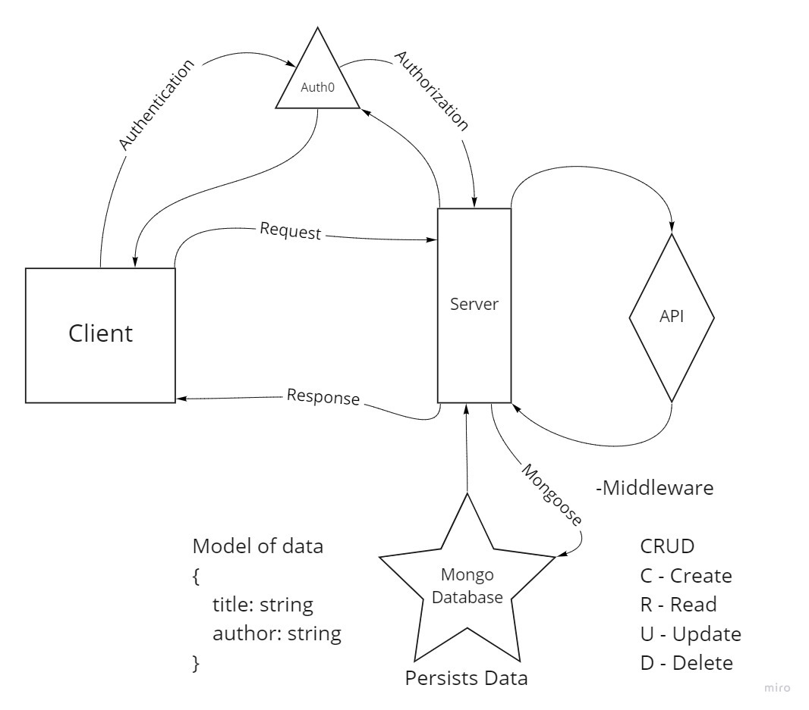

# Can of Books

**Author**: Quentin P Young III, Taylor White
**Version**: 2.0.0 - book data now retrieved from a MongoDB

## Overview
<!-- Provide a high level overview of what this application is and why you are building it, beyond the fact that it's an assignment for this class. (i.e. What's your problem domain?) -->

## Architecture

### UML

## Change Log

08-18-2021 9:05pm MongoDB now allows for persistent data. Database data is passed from server-side.s

## Features

*Feature 2: MongoDb*

Estimate of time needed to complete: 120min

Start time: 8:45pm 13AUG2021

Finish time: 9:00pm 14AUG2021

Actual time needed to complete: 145 min

*Feature 1: Auth0*

Estimate of time needed to complete: 180min

Start time: 2:30pm 14AUG2021

Finish time: 6:30pm 14AUG2021

Actual time needed to complete: 300 min
